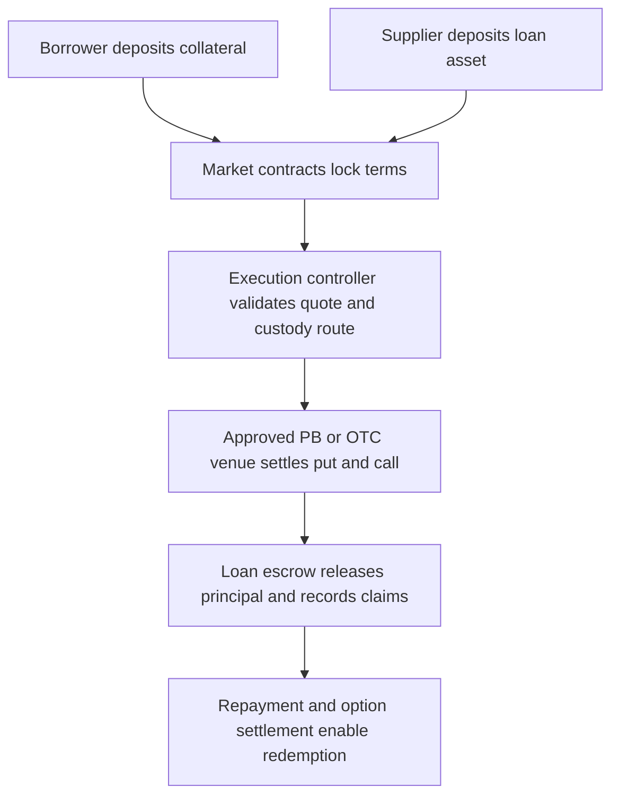

# Bima: Onchain Collar Loans

Permissionless markets for option\-funded digital asset credit\.

This repository contains the Bima white paper and its LaTeX source\. The design
combines a fixed\-term collateralized loan with a protective put and a covered
call\. The option package is intended to convert part of the collateral’s
upside into an upfront premium budget that can subsidize the lender’s return\.
When the budget is sufficient, the borrower can receive a zero headline\-rate
loan for the term while suppliers receive their return at the beginning of the
market\.

The result is not free money and it is not an assertion that risk disappears\.
The borrower gives up a defined portion of upside through the short call,
receives downside protection through the long put, and remains responsible for
repaying the loan at maturity\. Bima makes those tradeoffs explicit and
programmable\.

## The white paper

- [Read the PDF]([Bima_Programmable_Collateral_Finance.pdf](https://github.com/Bima-Labs/whitepaper/blob/main/Bima%20Whitepaper.pdf))
- [Read or modify the LaTeX source](Bima_Programmable_Collateral_Finance.tex)

The paper is authored by Siddarth Sridhar\. It presents the motivation,
financial mathematics, market lifecycle, permissionless contract model,
automated execution boundary, lender and borrower economics, and a rollover
design using BOOM staking as a future participation and alignment layer\.

## Why collar loans

The cost of capital is one of the largest constraints on sustainable digital
asset use\. Conventional overcollateralized lending protects the lender by
requiring excess collateral, but the borrower still pays a recurring rate and
can face margin calls or liquidation when the collateral price moves\.

A collar loan changes the financing package:

1. The borrower deposits an approved digital asset into an escrowed vault\.
2. The market calculates a bounded loan amount from the collateral value and
   the selected loan\-to\-value ratio\.
3. A protective put and a covered call are purchased and sold for the same
   collateral position and term\.
4. The net option premium is allocated to the supplier pool, the Bima fee
   schedule, and any required reserves\.
5. The borrower receives the loan asset and repays the principal at maturity\.

The collar defines a risk envelope rather than relying on discretionary credit
intervention\. The protocol does not need to liquidate the collateral during the
term to enforce a mark\-to\-market maintenance threshold\. Maturity settlement,
option settlement, and any shortfall policy remain explicit parts of the market
rules\.

## System model

Each market is a bounded instance with its own collateral asset, loan asset,
term, deposit window, LTV cap, option parameters, fee schedule, and execution
policy\. Suppliers fund the loan asset side of the market\. Borrowers fund the
collateral side\. The two sides are accounted for separately so that lenders do
not receive or custody borrower collateral\.



The contracts own the accounting state\. An execution service may call an
external options or custody API, but it cannot change the market’s rules\. It
must operate through a registered adapter, satisfy value and time bounds, and
submit an attestation that the observed quote and settlement match the market
configuration\.

## Market lifecycle

### 1\. Market creation

An approved factory creates a market from a bounded template\. The resulting
configuration records:

- collateral and loan asset addresses;
- oracle and valuation parameters;
- deposit window and fixed term;
- maximum LTV and minimum collateral amount;
- put and call strike rules;
- deposit fee, supplier return, Bima surcharge, and reserve policy;
- approved execution adapter and custody destination;
- pause and settlement authorities\.

The configuration is hashed and becomes immutable after the first deposit\. A
market creator cannot redirect funds, replace the custody destination, or
rewrite the economic terms of an active market\.

### 2\. Deposits

Borrowers deposit collateral into the vault during the deposit window and
specify the supported loan asset and requested LTV within the market bounds\.
Suppliers deposit USDC, USDT, or another approved loan asset into the separate
supply pool\. Supplier shares represent a claim on the pool’s committed
principal and settled premium allocation\. They are not claims on borrower
collateral\.

For a deposit amount $Q$ and a deposit fee $f\_d$, the net collateral used by
the market is:

$$
Q\_\{\\mathrm\{net\}\} = Q&#40;1\-f\_d&#41;\.
$$

The reference principal is bounded by the oracle price $S\_0$ and the selected
LTV $L$:

$$
D = \\min\\left&#40;D\_\{\\max\},; L S\_0 Q\_\{\\mathrm\{net\}\}\\right&#41;\.
$$

The initial Bima fee schedule described in the paper uses a 1% deposit fee and
a 1% annualized surcharge on the supplier return\. These values are market
parameters, not hidden deductions, and can be changed only through the market
configuration and governance process\.

### 3\. Close and automated collar execution

At the end of the deposit window, the market becomes executable\. The executor:

1. reads the final deposit and supplier balances;
2. computes the option quantity, strikes, premium budget, and required reserve;
3. requests an executable quote through an approved PB or OTC adapter;
4. verifies quote freshness, slippage, term, strikes, notional, and custody
   destination;
5. moves collateral only to the registered escrow or custody route;
6. executes the short call and long put as one bounded action set;
7. submits quote, fill, and settlement attestations to the execution controller;
8. settles the premium and unlocks the loan escrow\.

The onchain controller checks that the action is authorized for this market,
has not already been used, and satisfies all configured limits\. If a quote is
stale, outside tolerance, or inconsistent with the committed configuration,
the action fails and funds remain in the pre\-execution state\. The contracts do
not fabricate an offchain fill and do not accept an arbitrary recipient\.

### 4\. Claims and repayment

After successful execution, the borrower claims the committed loan asset\. The
supplier pool receives its premium allocation pro rata\. The borrower’s
collateral remains escrowed until the repayment and settlement conditions are
met\. At maturity, the borrower returns the principal and any market\-defined
settlement amount\. The vault then processes option settlement and enables
redemption of the remaining collateral according to the market rules\.

The protocol can support a no\-margin\-call, no\-liquidation term structure, but
that does not waive the maturity obligation\. If the borrower does not repay,
the documented default and recovery path governs the collateral and option
proceeds\.

## Economics and the no\-free\-lunch constraint

The collar is priced using a Black\-Scholes\-Merton reference model together with
an executable market quote\. For spot $S\_0$, call strike $K\_c$, put strike
$K\_p$, volatility $\\sigma$, risk\-free rate $r$, and time to expiry $T$,
the gross premium budget is represented as:

$$
\\Pi\_\{\\mathrm\{gross\}\} = Q\_\{\\mathrm\{net\}\}
\\left&#91;C\_\{\\mathrm\{BSM\}\}&#40;S\_0,K\_c,T,\\sigma,r&#41; \-
P\_\{\\mathrm\{BSM\}\}&#40;S\_0,K\_p,T,\\sigma,r&#41;\\right&#93;\.
$$

The net budget subtracts execution, custody, conversion, and settlement costs
$E$:

$$
\\Pi\_\{\\mathrm\{net\}\} = \\Pi\_\{\\mathrm\{gross\}\} \- E\.
$$

The market may unlock the zero headline borrower rate only when the settled
premium covers every committed allocation:

$$
\\Pi\_\{\\mathrm\{net\}\} \\ge I\_L \+ I\_B \+ R,
$$

where $I\_L$ is the supplier’s upfront return, $I\_B$ is the Bima surcharge,
and $R$ is the reserve or execution buffer\. If the inequality is not met,
the market must reject the configuration, reduce the principal, require a
borrower contribution, or follow its explicitly published fallback\. It cannot
promise a return that the collateral and options do not fund\.

Illustrative assumptions in the paper use a 45% implied volatility, a 7%
risk\-free rate, and a normalized spot price of 100\. These are modeling inputs,
not forecasts or production oracle values\. Production markets must use a
documented oracle policy and an executable quote policy\.

## Permissionless participation with bounded authority

Permissionless means that eligible users can join an open market without a
bilateral credit committee\. It does not mean that every contract address,
oracle, asset, or external venue is accepted without controls\.

Bima’s proposed boundary is:

- anyone can supply or borrow in an approved market;
- anyone can create a new market only through an audited factory and bounded
  templates;
- supported assets, oracles, custody routes, and execution adapters are
  explicit configuration values;
- active market terms are immutable after the first deposit;
- execution actions are nonce\-protected, replay\-resistant, and auditable;
- emergency pauses stop new actions without rewriting settled history;
- governance can add or retire templates, but cannot seize a user’s collateral
  through an ordinary execution call\.

This separates open access from unbounded authority\. The market remains
composable with wallets, aggregators, and other lending interfaces while the
contract surface stays narrow enough to audit\.

## Contract architecture

The minimum useful contract set is:

|Component            |Responsibility                                                                 |
|---------------------|-------------------------------------------------------------------------------|
|`MarketRegistry`     |Records approved assets, adapters, oracles, and market instances.              |
|`MarketFactory`      |Deploys a market from an audited template and commits its configuration hash.  |
|`BimaVault`          |Escrows collateral and tracks deposit, redemption, and settlement state.       |
|`SupplyPool`         |Holds the loan asset and tracks supplier shares and premium allocations.       |
|`LoanEscrow`         |Releases principal only after the collar execution is finalized.               |
|`ExecutionController`|Verifies quotes, action attestations, limits, nonces, and custody destinations.|

Important invariants include:

$$
U\_\{\\mathrm\{free\}\} \+ \\sum\_j A\_j = U\_\{\\mathrm\{total\}\},
$$

where free liquidity plus every market allocation equals total pool assets;

$$
I\_L \+ I\_B \+ R \\le \\Pi\_\{\\mathrm\{net\}\},
$$

for every market that advertises a zero headline borrower rate; and:

- one collateral position supports at most one active loan;
- a loan cannot be claimed before execution finalization;
- a supplier cannot withdraw committed principal before the market’s release
  condition;
- an execution action cannot be replayed;
- settlement cannot route funds to an address outside the committed custody and
  escrow set\.

The contracts do not call arbitrary web APIs\. The external execution layer is a
replaceable adapter service with authenticated credentials, quote validation,
custody reconciliation, and an onchain attestation interface\. This keeps the
custody and API integration replaceable without making the vault itself a
general\-purpose offchain executor\.

## Rollovers and BOOM staking

A rollover is a new financing term, not an extension of an old promise\. Before
the old term can roll:

1. the borrower repays or otherwise settles the existing principal;
2. the existing call and put are settled or closed;
3. the vault computes the collateral value and new LTV;
4. a fresh collar is priced for the new term;
5. the borrower satisfies any repayment, top\-up, or fee requirement;
6. the new market instance records a new configuration and claim set\.

BOOM staking is designed as a future access and alignment mechanism\. Subject
to governance and market capacity, a staked position may provide rollover
eligibility, priority, fee treatment, or other participation benefits\. Staking
does not erase repayment, guarantee a premium, or create a perpetual loan\. Any
buyback, incentive, or fee\-sharing policy must be published separately and
implemented with explicit caps\.

## Automation boundary

The critical end\-of\-window path is deterministic and observable:

```text
close window
  -> snapshot deposits and suppliers
  -> compute LTV and option quantities
  -> request and validate executable quote
  -> forward collateral to registered custody route
  -> execute put and call
  -> reconcile fill and settlement
  -> settle premium allocations
  -> unlock borrower and supplier claims
```

Every step should be idempotent\. The market records a unique action ID, the
configuration hash, the quote timestamp, the expected and actual notional, the
custody destination, and the final settlement amounts\. Retries can resume a
failed step without paying twice or releasing principal early\. A failed
execution leaves the market in a recoverable state and follows the configured
refund, retry, or unwind policy\.

## Build the paper locally

A TeX distribution such as TeX Live is required\. From the repository root:

```bash
pdflatex -interaction=nonstopmode -halt-on-error \
  Bima_Programmable_Collateral_Finance.tex
pdflatex -interaction=nonstopmode -halt-on-error \
  Bima_Programmable_Collateral_Finance.tex
```

The second pass resolves cross\-references and the table of contents\. The source
uses standard mathematics, graphics, tables, and hyperlink packages available
in a typical TeX Live installation\.

## Scope and disclosures

This repository is a design and research artifact\. It is not an offer to lend,
borrow, buy, or sell any financial instrument, and it is not legal, tax,
accounting, or investment advice\.

The white paper does not claim that the system is production\-ready merely
because a component has an audited analogue\. Before deployment, Bima Labs must
independently verify smart\-contract code, oracle behavior, custody and OTC
agreements, asset support, sanctions and jurisdictional requirements, key
management, incident response, and all economic parameters\. A zero headline
rate is conditional on the collar premium and published settlement policy; it
is not a guarantee of zero economic cost or positive returns\.

## Author

Siddarth Sridhar

Bima Labs
